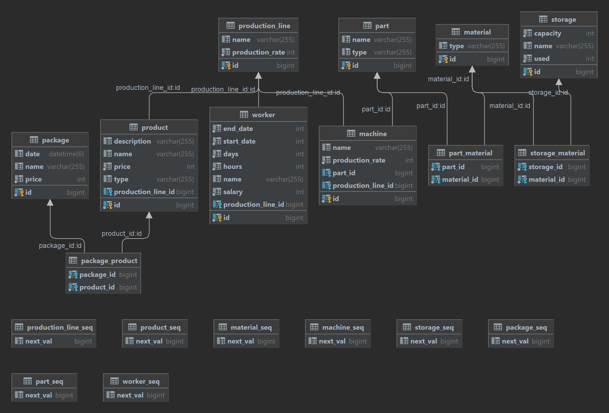

<h1>Cybernetic Factory simulation project</h1>

## Съдържание
* [Описание](#Описание)
* [Описание на базата данни](#Описание-на-базата-данни)
* [Как се ползва](#Как-се-ползва)
* [Използвани технологии](#Използвани-технологии)

## Описание

<p>Проектът представлъва симулация на фабрика за кибер части. Клиентите могат да правят поръчки към фабриката за определени продукти, произвеждани във фабриката.
Фабриката също така може да произвежда части, които се използват за производството на продуктите. Във фабриката има работници, които са разпределени по производствените линии, съставени от поредица от машини.
Машините сами по себе си произвеждат части, които накрая се събират в продукти. За създаването на частите се използват материали, които се съхраняват в складове.

## Описание на базата данни

<p>Базата данни се състои от 8 таблици, които са свързани помежду си. Таблиците са:
<ul>Packages - съдържа информация за пакетите, които се изпращат до клиентите</ul>
<ul>Products - съдържа информация за продуктите, които се произвеждат във фабриката</ul>
<ul>Parts - съдържа информация за частите, които се произвеждат във фабриката</ul>
<ul>Workers - съдържа информация за работниците във фабриката</ul>
<ul>ProductionLines - съдържа информация за производствените линии във фабриката</ul>
<ul>Machines - съдържа информация за машините във фабриката</ul>
<ul>Storages - съдържа информация за складовете във фабриката</ul>
<ul>Materials - съдържа информация за материалите, които се използват във фабриката</ul>

## Как се ползва

Проектът може да бъде хостван локално или чрез microsoft azure.

### Локално
За да се стартира проектът локално, трябва да се изпълнят следните стъпки:
1. Клониране на репозиторито
```sh
git clone https://github.com/HristiyanPetkov/CyberneticFactory.git
```
2. Създаване на база данни в MySQL Workbench
3. Конфигуриране на application.properties файла
4. Стартиране на проекта

### Microsoft Azure
За да се хоства проектът чрез Microsoft Azure, трябва да се изпълнят следните стъпки:
1. Клониране на репозиторито
```sh
git clone https://github.com/HristiyanPetkov/CyberneticFactory.git
```
2. Създаване на remote database в Azure
3. Създаване на нов spring web app в Azure
4. Deploy на проекта в Azure

## Използвани технологии

* [Spring Boot](https://spring.io/projects/spring-boot)
* [MapStruct](https://mapstruct.org/)
* [Lombok](https://projectlombok.org/)
* [MySQL](https://www.mysql.com/)
* [Maven](https://maven.apache.org/)
* [Microsoft Azure](https://azure.microsoft.com/en-us/)
